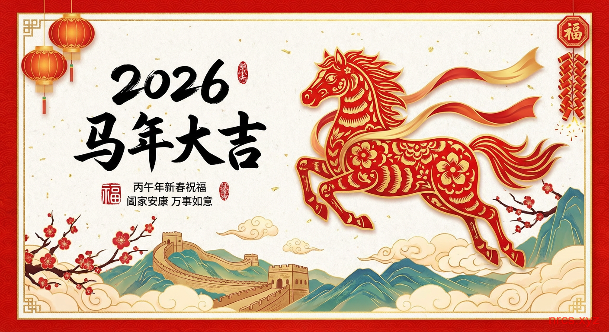
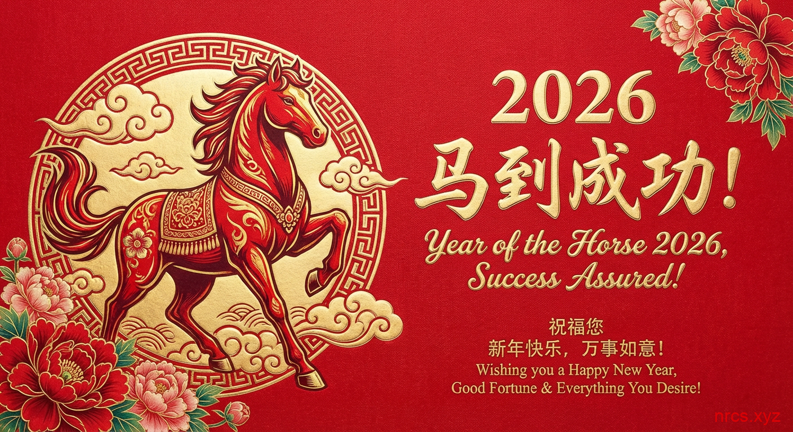

# NewYearCardsShare
2026年是中国传统的马年，象征着活力、自由、勇敢和成功。在中国，春节是一个重要的节日，大家通过赠送祝福语来表达新一年的美好愿望。无论是在家庭聚会，还是与朋友交流，春节祝福语都充满了温暖与希望，尤其对海外华人家庭而言，它们不仅是传递祝福的方式，更是文化传承的纽带。通过学习中文并了解祝福语的双语版本，不仅能够加深与亲友的情感联系，还能帮助孩子们在海外更好地学习中文。

我将为您提供2026年马年的60句新年祝福语，包含中文、拼音，帮助您在节日中传递温暖与祝福，也帮助孩子们在双语学习中提升中文能力。

## 2026马年新年祝福语——四字、八字、十字（附汉语拼音）

在2026年马年里，让我们用四字、八字和十字祝福语为亲友送去美好的祝愿，迎接充满希望与繁荣的一年！这些祝福语简洁有力，寓意深远，表达了我们对未来的美好期待。无论是四字成语，八字吉祥话，还是十字新年祝福，都充满了喜庆与祝福。

### 2026马年新年祝福语——四字成语

马到成功 (Mǎ dào chénggōng) — Wishing success at the first attempt

马年大吉 (Mǎ nián dà jí) — Great fortune in the Year of the Horse

马到成功，事业腾飞 (Mǎ dào chénggōng, shìyè téng fēi) — May your career soar like the horse

马鸣风起 (Mǎ míng fēng qǐ) — The horse’s cry heralds good fortune

财源广进 (Cáiyuán guǎng jìn) — Wealth flows in from all directions

金玉满堂 (Jīnyù mǎntáng) — Abundance and prosperity

心想事成 (Xīnxiǎng shì chéng) — Wishes and aspirations come true

喜气洋洋 (Xǐqì yáng yáng) — Joy and happiness fill the air

事事如意 (Shìshì rúyì) — Everything goes smoothly

福星高照 (Fúxīng gāo zhào) — Good luck and fortune shine upon you

鸿运当头 (Hóng yùn dāng tóu) — Good luck is at the forefront

吉祥如意 (Jíxiáng rú yì) — Auspicious and everything as you wish

### 2026马年新年祝福语——八字吉祥话

马到成功，事业有成 (Mǎ dào chénggōng, shìyè yǒu chéng)

马年大展，鸿运当头 (Mǎ nián dà zhǎn, hóng yùn dāng tóu)

马舞春风，财源广进 (Mǎ wǔ chūn fēng, cáiyuán guǎng jìn)

龙马精神，福寿安康 (Lóng mǎ jīngshén, fú shòu ān kāng)

马年大吉，吉星高照 (Mǎ nián dà jí, jíxīng gāo zhào)

马跃龙门，事事如意 (Mǎ yuè lóngmén, shì shì rú yì)

马年腾飞，事业辉煌 (Mǎ nián téng fēi, shìyè huīhuáng)

马踏千山，心想事成 (Mǎ tà qiān shān, xīn xiǎng shì chéng)

### 2026马年十字新年祝福语

马年迎新春，心想事成来。 (Mǎ nián yíng xīnchūn, xīn xiǎng shì chéng lái)

事业步步高，财源滚滚来。 (Shìyè bù bù gāo, cáiyuán gǔn gǔn lái)

马舞腾飞，家庭幸福全。 (Mǎ wǔ téng fēi, jiātíng xìngfú quán)

马年如意事，福运齐天高。 (Mǎ nián rúyì shì, fú yùn qí tiāngāo)

花开富贵来，家和万事兴。 (Huā kāi fùguì lái, jiā hé wànshì xīng)

龙马精神至，幸福万年长。 (Lóng mǎ jīngshén zhì, xìngfú wàn nián cháng)

## 2026新年祝福语——长辈、晚辈、朋友祝福（附拼音）

### 2026新年祝福语——长辈祝福（附拼音）

马到成功，事事如意！(Mǎ dào chénggōng, shì shì rú yì!)

祝您福如东海，寿比南山！(Zhù nín fú rú dōnghǎi, shòu bǐ nán shān!)

事业有成，家庭幸福！(Shìyè yǒu chéng, jiātíng xìngfú!)

马年吉祥，财源广进！(Mǎ nián jíxiáng, cáiyuán guǎng jìn!)

祝您身体健康，笑口常开！(Zhù nín shēntǐ jiànkāng, xiào kǒu cháng kāi!)

生活美满，家庭和谐！(Shēnghuó měimǎn, jiātíng héxié!)

马年大吉，鸿运当头！(Mǎ nián dàjí, hóng yùn dāng tóu!)

好运连连，心想事成！(Hǎo yùn lián lián, xīn xiǎng shì chéng!)

家和万事兴，马年添好运！(Jiā hé wàn shì xīng, mǎ nián tiān hǎo yùn!)

新的一年，万事顺利，笑口常开！(Xīn de yī nián, wàn shì shùnlì, xiào kǒu cháng kāi!)

### 2026新年祝福语——晚辈祝福（附拼音）

祝您新春快乐，身体安康！(Zhù nín xīnchūn kuàilè, shēntǐ ān kāng!)

祝福您福星高照，事事顺心！(Zhù fú nín fú xīng gāo zhào, shì shì shùn xīn!)

愿新的一年，心想事成，平安快乐！(Yuàn xīn de yī nián, xīn xiǎng shì chéng, píng’ān kuàilè!)

祝您事业兴旺，家庭幸福！(Zhù nín shìyè xīngwàng, jiātíng xìngfú!)

愿您的每一天都充满阳光与笑容！(Yuàn nín de měi yī tiān dōu chōngmǎn yángguāng yǔ xiàoróng!)

祝您在新的一年，健康长寿，快乐永驻！(Zhù nín zài xīn de yī nián, jiànkāng cháng shòu, kuàilè yǒng zhù!)

新的一年，愿您平安如意，天天开心！(Xīn de yī nián, yuàn nín píng’ān rú yì, tiāntiān kāixīn!)

愿您的生活如意，事业蒸蒸日上！(Yuàn nín de shēnghuó rú yì, shìyè zhēngzhēng rì shàng!)

祝您马到成功，财源滚滚而来！(Zhù nín mǎ dào chénggōng, cáiyuán gǔn gǔn ér lái!)

愿您新的一年，笑口常开，幸福满满！(Yuàn nín xīn de yī nián, xiào kǒu cháng kāi, xìngfú mǎn mǎn!)

### 2026新年祝福语——朋友祝福（附拼音）

马到成功，事业腾飞！(Mǎ dào chénggōng, shìyè téng fēi!)

愿你在新的一年，天天开心，心想事成！(Yuàn nǐ zài xīn de yī nián, tiāntiān kāixīn, xīn xiǎng shì chéng!)

新年新气象，马年大吉！(Xīn nián xīn qìxiàng, mǎ nián dàjí!)

祝你事事如意，心情愉快！(Zhù nǐ shì shì rú yì, xīnqíng yú kuài!)

春节快乐，家庭幸福！(Chūn jié kuài lè, jiātíng xìngfú!)

马年平安，快乐每一天！(Mǎ nián píng’ān, kuàilè měi yī tiān!)

祝你拥有更多的爱与希望，快乐满满！(Zhù nǐ yǒng yǒu gèng duō de ài yǔ xī wàng, kuài lè mǎn mǎn!)

新年新愿望，马到成功！(Xīn nián xīn yuànwàng, mǎ dào chénggōng!)

春节快乐，心想事成！(Chūn jié kuài lè, xīn xiǎng shì chéng!)

一切顺利，马年大发财！(Yīqiè shùnlì, mǎ nián dà fā cái!)

### 2026新年创意有趣新年祝福语

马年大吉，飞黄腾达！(Mǎ nián dà jí, fēi huáng téng dá!)

祝你在马年，骑上幸福的快车，事业步步高升！(Zhù nǐ zài mǎ nián, qí shàng xìngfú de kuài chē, shìyè bù bù gāo shēng!)

马年有财，心情愉快！(Mǎ nián yǒu cái, xīnqíng yú kuài!)

马年祝你事业腾飞，幸福快乐！(Mǎ nián zhù nǐ shìyè téng fēi, xìngfú kuàilè!)

祝你马年吉星高照，心想事成！(Zhù nǐ mǎ nián jí xīng gāo zhào, xīn xiǎng shì chéng!)

祝你在马年，事业飞黄腾达，家庭幸福美满！(Zhù nǐ zài mǎ nián, shìyè fēi huáng téng dá, jiātíng xìngfú měi mǎn!)

祝你在马年拥有无尽的好运和幸福！(Zhù nǐ zài mǎ nián, yǒng yǒu wú jìn de hǎo yùn hé xìng fú!)

马年幸福美满，事业有成！(Mǎ nián xìng fú měi mǎn, shìyè yǒu chéng!)

祝你马年财源滚滚，事业有成！(Zhù nǐ mǎ nián cáiyuán gǔn gǔn, shìyè yǒu chéng!)

马年大展宏图，平安快乐！(Mǎ nián dà zhǎn hóng tú, píng’ān kuàilè!)

## 2024新年祝福语英文（附中文汉语拼音）

May the Year of the Horse bring you success, health, and happiness.  
中文：愿马年带给你成功、健康和幸福。  
拼音：Yuàn mǎ nián dài gěi nǐ chéng gōng, jiàn kāng hé xìng fú.

Happy New Year! May you gallop towards your dreams in the Year of the Horse.  
中文：新年快乐！愿你在马年奔驰向前，追逐梦想。  
拼音：Xīn nián kuài lè! Yuàn nǐ zài mǎ nián bēn chí xiàng qián, zhuī zhú mèng xiǎng.

Cheers to a year of prosperity, joy, and boundless possibilities in 2026!  
中文：为2026年的繁荣、快乐和无限可能干杯！  
拼音：Wèi 2026 nián de fán róng, kuài lè hé wú xiàn kě néng gān bēi!

Wishing you a year filled with achievements, happiness, and dreams realized.  
中文：祝您一年充满成就、快乐和梦想成真。  
拼音：Zhù nín yī nián chōng mǎn chéng jiù, kuài lè hé mèng xiǎng chéng zhēn.

Happy 2026! May you find love, peace, and success in the Year of the Horse.  
中文：2026年快乐！愿你在马年找到爱、和平与成功。  
拼音：2026 nián kuài lè! Yuàn nǐ zài mǎ nián zhǎo dào ài, hé píng yǔ chéng gōng.

May your days in the Year of the Horse be filled with joy and fortune.  
中文：愿你在马年里每一天都充满快乐与好运。  
拼音：Yuàn nǐ zài mǎ nián lǐ měi yī tiān dōu chōng mǎn kuài lè yǔ hǎo yùn.

Wishing you a year of growth, success, and boundless opportunities.  
中文：祝你一年充满成长、成功和无限机遇。  
拼音：Zhù nǐ yī nián chōng mǎn chéng zhǎng, chéng gōng hé wú xiàn jī yù.

May the Year of the Horse bring you happiness, success, and a smooth journey ahead.  
中文：愿马年带给你幸福、成功和顺利的旅程。  
拼音：Yuàn mǎ nián dài gěi nǐ xìng fú, chéng gōng hé shùn lì de lǚ chéng.

## 2026马年创意有趣新年祝福语

在2026马年里，带着创意和幽默的祝福语，为自己和亲朋好友送上别具一格的新年祝福。从搞笑的玩笑话到富有趣味的数字祝福，让我们在新的一年中带着欢笑和轻松迎接每一天！

1.2026年到了，愿你马到成功，二马同心，三思后行，四季平安，五福临门，六六大顺，七彩祥云护航，八面玲珑，九天揽月，十全十美，成为人生的马中之王，步步高升！

2\. 2026的数字代表我对你最美好的祝福：愿你马到成功666（顺顺利利），事业飞跃888（发发发），财源滚滚888（发发发），爱你520（我爱你），幸福1314（一生一世）！马年大吉，财运亨通，马力十足！

3\. 马年来了，愿你像骏马一样驰骋天涯，唯有偶尔停下，看看我们这些走在地面上的人哦！别忘了带着马年的好运一起前进！

4\. 2026年，愿你的梦想像一匹飞驰的骏马，一路畅通无阻，飞速实现成功！希望你马年腾飞，事事顺利！

5\. 2026年，愿你“马”到成功，事业如马般势不可挡，爱情甜蜜如马蹄声响！让你的生活如马般奔腾，红红火火！

6\. 过去所有的遗憾都是2026年惊喜的铺垫，愿你马不停蹄地追逐梦想，拼尽全力的每一步都能带来你想要的成功和幸福！
